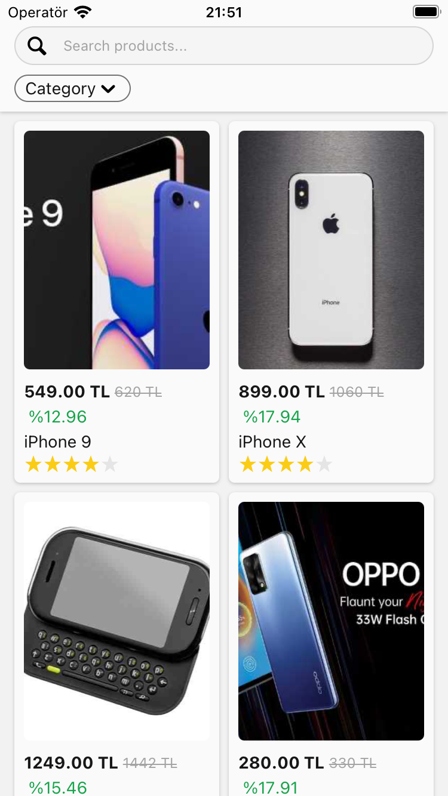

# E-Commerce Product Listing Application

This project is a simple product listing application developed for an e-commerce platform. The application will retrieve data from an API to display products to users and show their details.

## Requirements

### Used Libraries
- [React Navigation](https://reactnavigation.org/): Used for navigation structure.
- [React Native Bottom Sheet](https://gorhom.github.io/react-native-bottom-sheet/): Utilized as a modal for the product filtering page.
- [NativeBase](https://nativebase.io/): Used as the UI library. Defined a global color palette and button structure.

### Features
- Fetching products from an API
- Product listing
- Filtering and search functionality (by category, rating, price)
- Scrollable product list
- Fetching new products when reaching the bottom of the page
- Displaying product details (product name, price, description, rating, images)
- Slider for displaying images

## How to Run

1. Clone the project:

```bash
git clone https://github.com/muammertopcu/rn-ecommerce-example
```

2. Navigate to the project directory:

```bash
cd rn-ecommerce-example
```

3. Install dependencies:

```bash
npm install
```

4. Running the project:

For Android:

```bash
npx react-native run-android
```

For iOS:

```bash
npx react-native run-ios
```

## Screenshots


